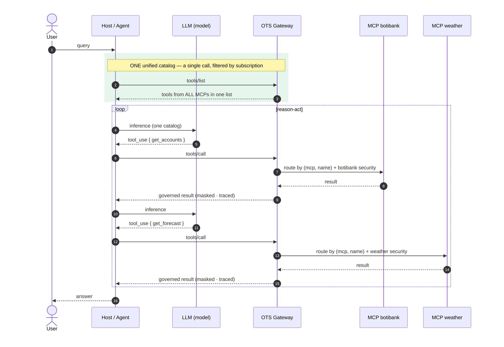

<p align="center">
  
</p>

<h1 align="center">OTS — OpenTool Specification</h1>

<p align="center">
  OTS provides a standard way to describe what a tool does, what it expects, and what it returns, abstracting away the details of how it is built, deployed, or executed. This enables interoperability across different platforms, frameworks, and runtimes.
</p>

<p align="center">
  By <a href="https://github.com/psagarna">Pablo D. Sagarna</a>
</p>

---

## Introduction

The Model Context Protocol (MCP) has made it far simpler to expose backend capabilities to autonomous agents. Its spread across distributed environments, though, introduces a potential architectural bottleneck.

In an ecosystem of many MCP servers, each exposing tens — or even hundreds — of tools, the agent runtime has to manage discovery of and access to those distributed capabilities. When the full tool catalog is loaded into the LLM's context, a **tool/context bloat** appears: the model must process an ever-growing amount of metadata just to decide which tool best resolves each request. This can significantly increase token consumption, latency and inference cost, and it compounds the complexity of tool routing and orchestration.

To mitigate this architectural inefficiency, the discovery layer must be **consolidated and decoupled from the execution layer**. The answer is a centralized capability catalog that presents the agent with a unified, semantically consistent representation of the available tools, abstracting away their physical implementation and the concrete MCP server that ultimately runs the operation. This decoupling between a tool's **semantic interface** and its underlying **execution mechanism** is a foundational principle for regaining control over the scalability, governance and evolution of the agent ecosystem.

The approach unlocks critical engineering advantages:

- **Centralized governance and security** — audit the available tools and apply authorization, RBAC, access control and policy enforcement at fine granularity, before a request ever reaches the corresponding backend.
- **A Design-First, accelerated SDLC** — an implementation-independent contract from which mocks, stubs and automated test environments are generated, so agent teams can design and validate workflows without waiting for the real MCP tool to be fully built.
- **Decoupling and independent evolution** — evolve a tool's implementation, change the underlying MCP server, or replace it entirely, without necessarily touching the semantic interface the agent consumes.
- **Optimized tool routing** — with a structured, normalized catalog, the system can add semantic search, filtering, ranking or routing to hand the LLM only the tools relevant to each context.

In answer to these scalability, governance and control challenges, the **OpenTool Specification (OTS)** was born. OTS is a declarative, language-agnostic contract that acts as the **single source of truth** for defining and exposing agent-facing capabilities. It rigorously standardizes *which* tools, resources and prompts exist, strictly defines the data schemas they accept and return, and establishes the topology by which these interfaces map to their execution mechanisms — MCP servers included — in production.

OTS thus separates three concepts that traditionally stay coupled: **what** capability is offered, **how** it is discovered, and **where/how** it is executed. That separation is what makes an agent architecture scalable, governable, and able to evolve independently of the infrastructure that implements each capability.

---

## Reference architecture: point-to-point MCP access versus centralized governed access

The same workload — an agent consuming tools from several MCP servers — in two topologies. Point-to-point, every server authenticates, authorises and is discovered on its own terms. Through the OTS Gateway, one catalogue is published and every call is authorised, metered and recorded before it reaches a backend.

**Without OTS.** The agent talks directly to every MCP server, holding each backend's secrets. Discovery is fragmented — one `tools/list` per server, no single catalog — the agent sees every tool each server exposes with no per-consumer allowlist, raw responses with PII flow straight into the model's context, and there is no single point at which to authorize per tool, cap consumption, or trace who called what.


**With OTS.** The agent points only at the gateway. It returns one aggregate catalog filtered by the caller's subscription, routes each call to the right MCP by `(mcp, name)`, handles each backend's own security centrally (OAuth2 for one, an API key for another), and masks, bounds, rate-limits and traces every call — all under a single consumer, plan and quota.



---

## The specification

OTS describes an **HTTP MCP tool** the way OpenAPI describes a REST endpoint: a language-agnostic
file that a person or a machine can read to know what the service does — without the source, without
the docs, and without watching the traffic.

An OTS document declares three kinds of thing, and the same fields describe all three:

| | |
|---|---|
| **tools** | what the model decides to call |
| **resources** | what the application attaches to the model's context, by address |
| **prompts** | templates the user picks, filled with arguments |

The point of writing one is that the description is **operational**, not documentary. The same file
says what the agent sees *and* how to reach the real service — so one document is the contract, the
translation, the validation, the test fixture and the governance rule.

---

## Writing one

### The skeleton

```yaml
ots: "1.0.0"

info:
  title: "BotiBank Core Tools"
  version: "1.2.0"
  description: "Herramientas para operar sobre el core del banco."
  contact:
    name: "Equipo de Arquitectura"
    url: "https://api.botibank.com/developers"

# Where the tools are served from, unless one of them says otherwise.
servers:
  - protocol: streamable-http
    url: "https://localhost:8243/botibankmcp/1.0/mcp"
    description: "WSO2 API Gateway"

# What every tool of this document demands, unless it declares its own.
security:
  - AgentOAuthClientCredentials: []

tools: { }
resources: { }
prompts: { }
components: { }
```

### A tool, field by field

```yaml
tools:

  consultar_cuentas:
    name: "consultar_cuentas"          # must equal the key, or the document is refused
    summary: "Consultar cuentas de un cliente"
    description: "Lista las cuentas bancarias de un cliente dado su ID."

    # The prompt the model reads to decide whether to call it. Say what it does,
    # when to use it, and whether it changes anything.
    aiHints:
      whenToUse: "Úsalo para verificar el saldo de las cuentas de un usuario."

    # The translation. The agent's vocabulary is not your backend's.
    backend:
      tool: "get_cuentas"              # what it is really called over there
      arguments:
        clienteId: "cliente_id"        # their name ← yours

    cache:
      ttlMs: 300000                    # freshness hint for the catalogue
    idempotent: true                   # may be retried on a replica. Absent means no

    inputSchema:
      type: "object"
      required: [ "cliente_id" ]
      additionalProperties: false
      properties:
        cliente_id: { type: "string", description: "ID del cliente (UUID)" }
      example:
        cliente_id: "71992c72-cc1c-4c5a-8b50-9ee4fb6c214d"

    outputSchema:
      type: "object"
      additionalProperties: false
      properties:
        cuentas:
          type: "array"
          items:
            $ref: "#/components/schemas/Cuenta"
```

| Field | | |
|---|---|---|
| `name` | **enforced** | must equal the key of the map |
| `summary` · `description` | shown | the second is what the model reads to decide |
| `backend` | **enforced** | the name and the argument shape the real MCP expects |
| `inputSchema` | **enforced** | validated on every call, before anything leaves |
| `outputSchema` | **enforced** | validated, masked and projected on the way back |
| `cache.ttlMs` | **enforced** | the shortest among the visible tools becomes the `ttlMs` of `tools/list` |
| `idempotent` | **enforced** | whether a failed call may be retried on a replica. Absent means no, which is the safe reading for a contract that has not thought about it |
| `security` | **enforced** | the scopes this tool demands |
| `server` | **enforced** | which backend answers this one tool |
| `example` · `examples` | **enforced** | what the mock answers with |
| `icons` | shown | passed through to the agent |
| `aiHints` · `policies` · `errors` | documentary | today; candidates to become enforced |

### What may leave: `outputSchema` and masks

A list is always declared **wrapped**, never as a top-level `type: "array"` — MCP requires a tool
with an `outputSchema` to answer with `structuredContent`, and types that as an object. A document
that declares a bare array is refused.

```yaml
outputSchema:
  type: "object"
  properties:
    cuentas:
      type: "array"
      items:
        type: "object"
        additionalProperties: false
        properties:
          cuentaId:  { type: "string", x-ots-mask: "last4" }
          clienteId: { type: "string", x-ots-mask: "hash"  }
          saldo:     { type: "number" }
```

`x-ots-mask` masks a field **before it reaches the agent** — and therefore before it reaches a model's
context, the trace and the journal:

| | |
|---|---|
| `full` | `•••` |
| `last4` · `first4` | `•••-122` · `CTA-•••` |
| `email` | `a•••@example.com` |
| `hash` | `sha256:06510c3363bd` — correlate two records without exposing the value |
| `drop` | the field disappears |

### Scenarios: the contract answers on its own

Name a few, pair each request with its response, and **include the failures**. A tool with scenarios
answers before its backend exists, which is what makes a specification something you can develop
against:

```yaml
    examples:
      default:
        summary: "Cliente con dos cuentas"
        input: { cliente_id: "71992c72-cc1c-4c5a-8b50-9ee4fb6c214d" }
        value:
          - { cuentaId: "CTA-122", saldo: 1800.50, tipo: "Corriente" }
          - { cuentaId: "CTA-999", saldo: 0.00,    tipo: "Ahorro" }

      cliente_inexistente:
        summary: "El cliente no existe en el core"
        input: { cliente_id: "00000000-0000-0000-0000-000000000000" }
        error:
          code: -32602
          message: "Cliente no encontrado"

      tarea_larga:
        summary: "Una consulta que el core resuelve en segundo plano"
        task: { pollsUntilDone: 2, pollIntervalMs: 300 }
        value: [ ]
```

### Scopes, per document or per tool

```yaml
  transferir_dinero:
    name: "transferir_dinero"
    summary: "Transferencia entre cuentas"
    backend:
      tool: "post_cuentas_by_cuentaId_transferir"
      arguments:
        cuentaId: "cuenta_origen"
        "requestBody.cuentaDestino": "cuenta_destino"   # dotted paths reach into the body
        "requestBody.monto": "monto"
    idempotent: false                                   # never retried: it moves money
    security:                                           # more than the agent's own credential
      - UserDelegationOAuth: [ "bank:transfer:execute" ]
    errors:                                             # what a status means, in words an agent can act on
      "402":
        rpcCode: -32000
        description: "Saldo insuficiente."
        aiAction: "Dile que la cuenta origen no tiene fondos."
```

A list of alternatives: satisfying **any one** of them is enough.

### Which backend answers a tool

`servers` at the top of the document is the default. One tool can override it — and it does not have
to be another MCP server:

```yaml
    server:
      - protocol: database
        url: "mariadb://127.0.0.1:3306/botibank?getCuentasByCliente"
```

### Resources and prompts

```yaml
resources:
  politica_privacidad:
    title: "Política de privacidad"
    description: "El texto legal vigente, para que el agente pueda citarlo."
    uri: "ots://botibank/politica-privacidad"
    mimeType: "text/markdown"
    cache: { ttlMs: 3600000 }
    example: |
      # Política de privacidad v2.1

  movimientos_cuenta:
    title: "Movimientos"
    uriTemplate: "ots://botibank/cuentas/{cuentaId}/movimientos"   # parameterised
    mimeType: "application/json"
    example:
      - { date: "2026-09-01", amount: -50.00, concept: "Supermercado" }

prompts:
  resumen_mensual:
    title: "Resumen mensual"
    description: "Resume el gasto del mes de una cuenta."
    arguments:
      - name: "cuenta_id"
        description: "La cuenta a resumir"
        required: true
    example:
      messages:
        - role: "user"
          content: { type: "text", text: "Analiza la cuenta {cuenta_id}…" }
```

### Shared schemas and security schemes

```yaml
components:
  schemas:
    Cuenta:
      type: "object"
      properties:
        cuentaId: { type: "string" }
        saldo:    { type: "number" }
        tipo:     { type: "string", enum: [ "Corriente", "Ahorro", "Inversión" ] }

  securitySchemes:
    AgentOAuthClientCredentials:
      type: oauth2
      description: "Token máquina a máquina del agente"
      flows:
        clientCredentials:
          tokenUrl: "https://localhost:8243/oauth2/token"
          scopes: { "mcp:invoke": "Llamada básica a herramientas" }

    UserDelegationOAuth:
      type: oauth2
      description: "Token del usuario final, para lo que mueve dinero"
      flows:
        authorizationCode:
          authorizationUrl: "https://localhost:8243/oauth2/authorize"
          tokenUrl: "https://localhost:8243/oauth2/token"
          scopes: { "bank:transfer:execute": "Aprobación de movimientos de fondos" }
```

---

## The OTS Gateway

The reference implementation, and today the only thing that reads an OTS document and does something
with it. A single Go binary: no runtime, no database of its own, no sidecar.

Your agents never talk to your MCP servers. They talk to the gateway, which **authenticates** the
agent, **authorises tool by tool** with the scopes the contract demands, **charges for it** — rate,
hourly and daily quotas, and a token budget for the context the answers spend — **proxies** the call
handling whatever the backend needs, **validates and masks** what comes back, and **records the whole
trip**: the agent's request, what went to the backend, what came back, what the agent finally got.

It serves the three primitives on three revisions of the MCP protocol (`2026-07-28`, `2025-11-25`,
`2025-06-18`), and a tool can be answered by another MCP server, by a SQL query, or by its own
scenarios.

### Running one

Two ways, and neither of them builds anything.

**From VS Code.** One package, any platform — it carries no gateway, so it runs the one you point it
at:

```
code --install-extension ots-designer-<version>.vsix --force
```

Tell it which binary to run, in your settings or in the project itself, so each deployment uses the
gateway it needs:

```jsonc
// .vscode/settings.json
{ "ots.gatewayPath": "/path/to/otsgw" }
```

Then `OTS: New deployment…` writes a working deployment — a specification, `ots.json`, the secrets
and a `.gitignore` — and **▶** starts it, with its log in the editor's own output channel. Left
unset, the extension looks for `otsgw` beside the configuration and in `dist/`, so a checkout needs
no setting at all.

**From the command line, with the binary for your architecture.** One file, no runtime and no
installer:

| | |
|---|---|
| macOS | `otsgw-1.0.0-darwin-arm64.tar.gz` · `darwin-amd64` |
| Linux | `linux-amd64` · `linux-arm64` · `linux-arm` · `linux-386` |
| Windows | `otsgw-1.0.0-windows-amd64.zip` · `windows-arm64` |
| FreeBSD | `freebsd-amd64` |

```bash
tar -xzf otsgw-1.0.0-darwin-arm64.tar.gz     # or the .zip on Windows
./otsgw -config ots.json                     # ./otsgw alone prints every way to start it
```

`shasum -a 256 -c SHA256SUMS.txt` says nothing was tampered with, and `./otsgw -version` says which
build a machine is running.

Either way, the first thing the log prints is where everything is — the dashboard and the console
links with their access key already resolved, so they open:

```
📍 Where everything is
   gateway        http://localhost:3002/mcp/messages
     ↳ botibank   http://localhost:3002/botibankots/mcp/messages
   dashboard      http://localhost:3004/?key=Sq6u8qwnkfTM7LhqwlMAhysa
   console        http://localhost:3005/?key=ufEAXMXAHZqG1jTnxy1sTwnk
   mock server    http://localhost:3006
   journal        logs/transactions.jsonl (rotates at 64 MiB)
```

A deployment written by the extension is mocked from the specification's own scenarios, so its tools
answer before any backend exists. A credential that is missing stops the gateway on load, by name,
rather than at the first call.

### The OTS Gateway: `ots.json`

The OTS Gateway is configured through the `ots.json` file, which serves as the central configuration
source for the runtime. It defines the embedded gateway server settings, including networking and
execution parameters, together with one or more OTS specifications that the gateway will publish.
During startup, the gateway reads this configuration and automatically exposes the configured OTS
capabilities to agents and consumers.

The runtime is the **OTS Gateway**: agents talk to it, never to the MCP servers behind it. It
authenticates the caller, authorizes tool by tool against the subscription, enforces the plan, and
proxies each call to the real backend with whatever security that backend requires — then masks,
bounds and traces what comes back. Beyond that, the gateway can:

- **mock from the spec's own examples** — a tool answers from the scenarios declared in the specification, so an agent is exercised end to end before the backend exists;
- **serve a tool from a database** — a SQL query becomes an MCP tool with the same contract as any other, and a consumer cannot tell which is which;
- **and more in future versions** — the gateway is where new governance and execution capabilities land over time.

```jsonc
{
  "otsgateway": { "server_port": "7082", "watch_files": true },
  "dashboard":  { "port": "7084", "access_key": "env:OTS_DASHBOARD_KEY" },
  "console":    { "port": "7085", "access_key": "env:OTS_CONSOLE_KEY"  },
  "mock_server":{ "enabled": true, "server_port": "7086" },
  "telemetry":  { "file": "logs/transactions.jsonl", "max_history": 500 },

  "plans": {
    "free": { "rate_per_second": 2, "burst": 5,
              "quota_hourly": 60, "quota_daily": 500,
              "tokens_hourly": 50000, "max_tokens_per_call": 12000 }
  },

  "mcps": [{
    "name": "botibank",
    "context_path": "/botibank",                 // its own endpoint
    "ots_file": "boti-bank-ots.yaml",            // ← the specification
    "output": { "enforce": "warn" },             // off · warn · reject
    "backend_server": [
      { "name": "Core",
        "url": "https://localhost:8243/botibankmcp/1.0/mcp",   // the spec's servers entry
        "mock": { "enabled": false },                          // mocked per destination
        "security": { "type": "OAuth2",
                      "token_url": "https://localhost:9443/oauth2/token",
                      "consumer_key": "env:BOTIBANK_KEY",
                      "consumer_secret": "env:BOTIBANK_SECRET" } },

      { "name": "Cuentas",                                     // what a tool's own
        "type": "database",                                    // server: points at
        "url": "mariadb://127.0.0.1:3306/botibank?getCuentasByCliente",
        "query_file": "sql/getCuentas.sql",
        "security": { "type": "password", "username": "app", "password": "env:DB_PASSWORD" } }
    ]
  }],

  "subscriptions": [{
    "consumer_name": "c0",
    "security": [{
      "mcps": [{ "botibank": {                                       // "*" is also allowed
        "tools": [ { "transferir_dinero": ["bank:transfer:execute"] },  // the scopes this
                   "consultar_cuentas" ],                               // credential shows there
        "resources": [ { "movimientos_cuenta": ["cuentas:read"] }, "politica_privacidad" ],
        "prompts": [ { "revisar_clientes": ["clientes:read"] }, "resumen_mensual" ]
      } }],
      "auth_method": [{ "api_key": "env:C0_API_KEY" }],
      "key_plan": "free"
    }]
  }]
}
```

**Two gates, and they answer different questions.** The allowlist says *what this consumer may
touch*, and denies by default. The `security:` of the specification says *what that primitive
demands*, and the credential has to satisfy it: the scope claim of a bearer token, or — for an API
key, which has nowhere else to carry one — what the configuration declares beside it.

Putting the scopes on the entry narrows them to the primitive that needs them. The key above carries
`bank:transfer:execute` when it transfers money and nowhere else, which is the difference from
`auth_method[].scopes`, where one scope is carried into every call the credential makes.

| Entry | What the credential shows there |
|---|---|
| `"consultar_cuentas"` | its own scopes: what every allowlist written before this meant |
| `{ "transferir_dinero": ["bank:transfer:execute"] }` | that scope, and only for that tool |
| `{ "consultar_cuentas": [] }` | nothing: it satisfies only a contract that demands none |
| `{ "estado_servicio": ["*"] }` | the contract of that one is not applied to this consumer |

Against a bearer token the configuration can only **narrow** what the provider granted, never add to
it. The exemption is the one way past the contract and it has to be written: silence never widens
anything, so no subscription changed meaning when this arrived.

---

## OTS Designer, for VS Code

A tool for writing the specification, and for watching what the gateway does with it. Install the
`.vsix` for your platform and reload the window; it carries the gateway inside, so there is nothing
else to install.


| | |
|---|---|
| **The specification, as a form** | tools, resources, prompts, schemas and scenarios. Every edit replaces exactly the value it changes: comments, key order and formatting survive |
| **The deployment, as a form** | plans, consumers, credentials, MCPs, and a secret store that never shows a value back |
| **The map** | who calls, what they call, what answers — with every call travelling it live. Grant a permission by dragging a line |
| **The `curl` for any tool** | right-click it: as any consumer, against the backend or the mock, written for your shell |
| **A breakpoint that holds a real call** | it stops where you put it, shows what the agent asked and what is about to happen, and goes when you say |
| **A deployment from nothing** | *OTS: New deployment…* writes the configuration, a contract and the secrets, already working |
